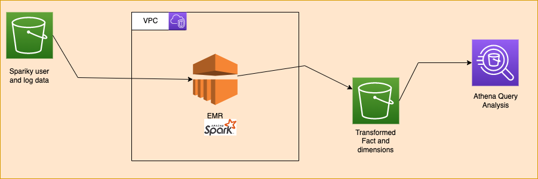

# Introduction 🚀
The Sparkify organization has been very famous in the recent times therefore the data has been grown very large. Hence, they would like to hire a Data Engineer who can perform etl on their data stored on amazon S3. For this purpose, the requirement is to process the data stored in S3 by spinnning up an AWS EMR cluster, transform the data in accordance to the requirements and write the processed data back to S3.

# Visual Architecture


# Idea and Execution Steps ☘️
The idea is to create a bucket by name and upload the source code required items into the created bucket in S3. For this job, there is a shellscript which spins up based on the provided parameters:  
**Note: All the scripts in the job folder assume a profile is created. In my case it is udacity-de-course. When you run it, change them accordingly.**  
Command:  `sh jobs/s3_job.sh CREATE <Bucket_Name> <Source_Code_Path>`  
Example:  
`sh jobs/s3_job.sh CREATE emr-et-udacity13321 /Users/kent/Udacity/Spark_Project/spark-etl-aws/`  
Once, after the code is successfully uploaded into S3. Create a AWS EMR Cluster with the default configurations. For this, a script is created to ease to the creation. When you run it modify the KeyName, profile, bootstrapping S3 file path for this to work.     
Command: `sh jobs/emr_job.sh`  
This is wait until the cluster is created. Once, the cluster is created goto AWS console, and go on to search bar and type EMR. The created cluster should be shown in clusters tab. In the summary tab, below Security and access Click on the asign security group. Once, in the Security Group Page edit the inbound rules for SSH Port-22 and change the provided IP set to your IP Address. Save the rule.  
From EMR console in the aws Summary, you should how to connect to master node through ssh. It is `ssh -i <your_key.pem> hadoop@ec2_dns`. Once, you are connected into the master node of the EMR cluster. Do the following:  
1. Pull the uploaded job scripts to master node. `aws s3 cp s3://code/ ./ --recursive`.
2. Configure all the required configurations and run `spark-submit etl.py`
3. Once, everything is run you should see the output in configured S3 directory. Also, note that I had to create a S3 output directory before hand and point it in `dl.cfg` file.
4. Using these parquets, Amazon Athena can be used to run queries top of it.

## Folder is Structured as follows 📁:
```
data
 |
 |---- Contains the local zip data. Note, that the configurations will have to change and etl.py changes.
 |
docs
 |
 |--- Contains the documents required for README file
 |
jobs
 | ---- bootstrap.sh --> Simple bootstrapping for EMR
 | ---- emr_job.sh --> Creates an EMR cluster with defined configurations.
 | ---- s3_job.sh --> Will create S3 bucket for uploading the source code. Can also TEARDOWN if required.
 |
local_processed_data
 |
 | ---- Contains the local processed pyspark job output
 |
dl.cfg --> Contains the configurations for running the etl job
etl.py --> The actual source code to perform the etl.
README.md --> The project details information file.
sql_queries.py --> Sql queries designed for spark, creating a schema-on-read.
test.ipynb --> The actual test file for understanding the underlying data, performing steps to avoid duplicates and nulls.
```

### Extensions: :pencil:
1. Making the IaC in jobs to be generic.
2. Utilizing and understanding step functions. Adding it within the IaC
3. Adding some ideas on Athena 

### Give a :star: if this project has been useful to you in any ways.
